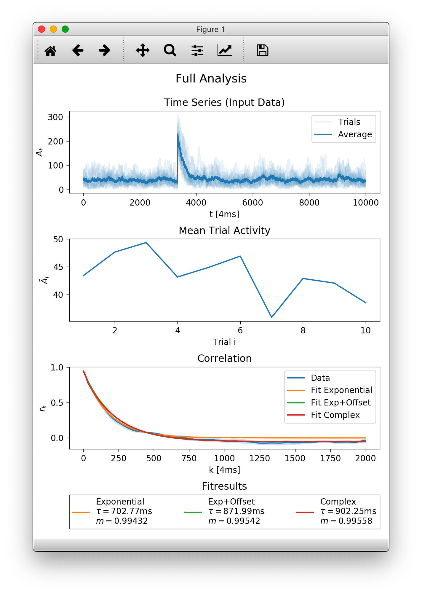
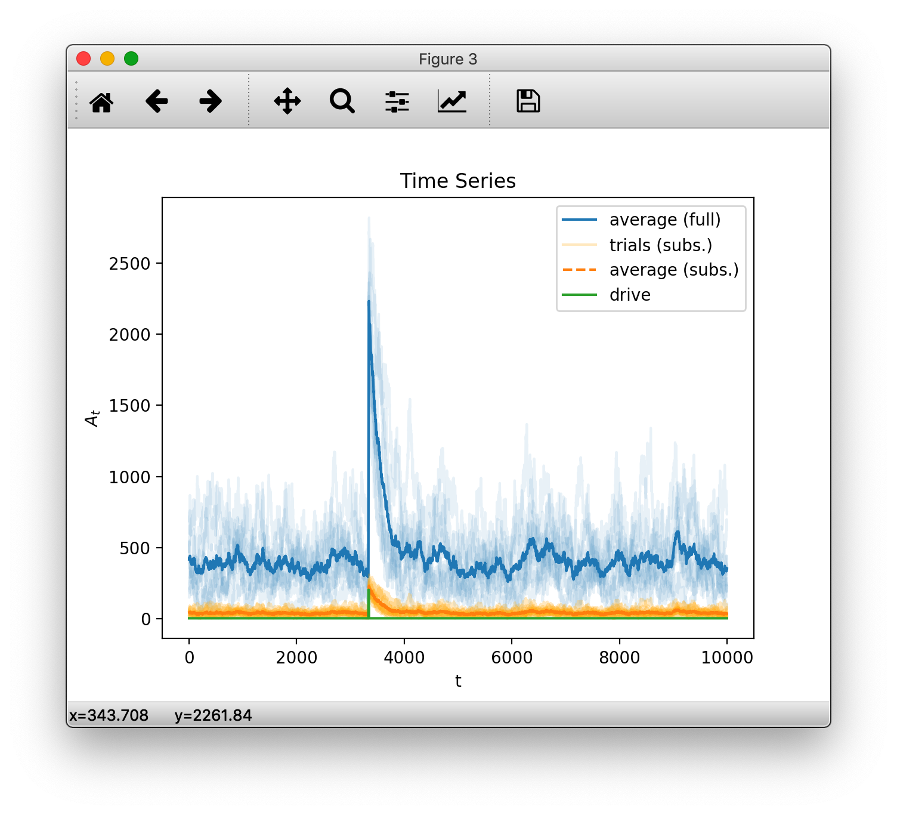
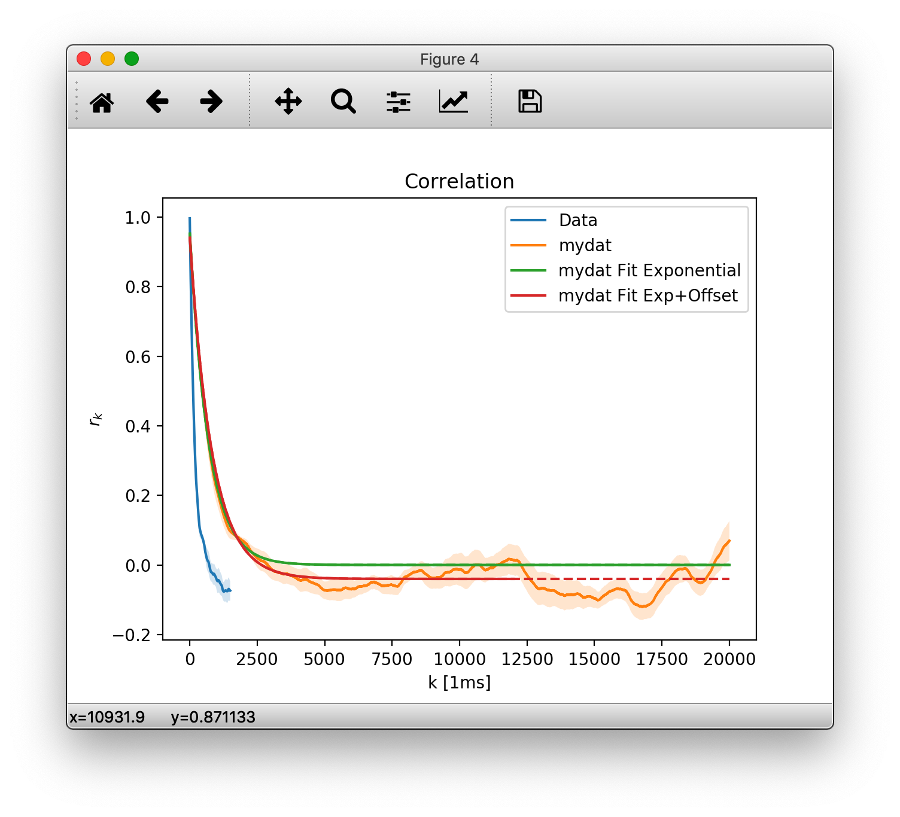

Getting Started
===============

.. automodule:: mrestimator

If you `installed the toolbox
<https://github.com/Priesemann-Group/mrestimator#installation>`_
via pip, you can import it directly. Also import
numpy and matplotlib, most examples in the documentation use them.

.. code-block:: python

    import numpy as np
    import matplotlib.pyplot as plt
    import mrestimator as mre
..

If you installed the toolbox manually, add the location where it is stored before importing, so python can find it.

.. code-block:: python

    import sys
    sys.path.append('/path/to/mrefolder/')
..

Below we walk through the example script with provided data, you may
either follow step by step by copying snippets into a python console
or run the full script and modify it to your needs.

You can grab the resources on
`github <https://github.com/Priesemann-Group/mrestimator/tree/master/examples/getting_started>`_.

Preparing Data
--------------

The toolbox is built with spike-train data in mind where an activity
:math:`A_t` is recorded for sequential times :math:`t`. :math:`A_t` can be
the number of recorded events in an interval or a continuous observable.

Furthermore, source data needs to be in a trial (replica) structure. We use a two-dimensional :obj:`numpy.ndarray`
where the first index is the trial number and the
second index the measurement point (sample) at time :math:`t`.
Even if there is only one time series
(one repetition), we still use the first index.
All trials need to have the same length. If they are too short or too long,
you will have to trim them (this will be more flexibel in the
future).

In a typical scenario, you want to read your data from disk. For reading
plain text files we will use the :func:`input_handler`.

Download
`the example data <https://github.com/Priesemann-Group/mrestimator/raw/master/examples/getting_started/data.zip>`_
and remember where you saved it, e.g. `/Users/me/example/data/`.
In a new python shell, set the work directory so we can use relative paths and create an
`output` directory to save results

.. code-block:: python

    import os

    os.chdir('/Users/me/example/data/')
    os.makedirs('./output', exist_ok=True)
..

First, let us import data from a single file `./data/full.tsv` where
each column corresponds to one trial (repetition). In the example we have
ten trials with length 10000.

.. code-block:: python

    filepath = './data/full.tsv'
    srcful = mre.input_handler(filepath)
    print('srcful has shape: ', srcful.shape)
..

We can also import a single column if the others contain unwanted data.
`drive.tsv` contains a continuous index in the first (zeroth) column and
the actual drive we used for the example branching process in the second
(first) column.

.. code-block:: python

    srcdrv = mre.input_handler('./data/drive.tsv', usecols=1)
    print('drive has shape: ', srcdrv.shape)
..

Note how the returned structure again has two dimensions, even though we only
have one timeseries.

We can also pass a list of filepaths or use wildcards ``*`` to match a file
pattern. The `./data/sub_*.tsv` files have one column each, so we will get
three trials for the filelist and ten when using the wildcard, since there
are ten files matching the pattern.

.. code-block:: python

    filelist = [
        './data/sub_01.tsv',
        './data/sub_02.tsv',
        './data/sub_03.tsv']
    srcsub = mre.input_handler(filelist)
    print('imported trials from list: ', srcsub.shape[0])

    # overwrite srcsub
    srcsub = mre.input_handler('./data/sub_*.tsv')
    print('imported trials from wildcard: ', srcsub.shape[0])
..

The advantage of the trial structure is that we can easily compute
e.g. averages over all trials:

.. code-block:: python

    avgful = np.mean(srcful, axis=0)
    avgsub = np.mean(srcsub, axis=0)
..

Analysis
--------

For convenience, we have built a wrapper function :func:`full_analysis` that
does all the sequential steps (preparing data, fitting coefficients, fitting
and exporting) in the right order. As you might see, it uses the import_handler
like we have just done manually.

Please note: :func:`full_analysis` might change in the future as we are
still experimenting to find out what the easiest interface is.
Check the
`changelog <https://mrestimator.readthedocs.io/en/latest/doc/changelog.html>`_
before updating, so your scripts dont break.

.. code-block:: python

    auto = mre.full_analysis(
        data='./data/sub_*.tsv',
        coefficientmethod='ts',
        targetdir='./output',
        title='Full Analysis',
        dt=4, dtunit='ms',
        tmin=0, tmax=8000,
        fitfuncs=['exp', 'exp_offs', 'complex'],
    )

    plt.show()
..

A window should pop up looking something like below.

At the top there is an overview of the imported data. Individual
trials/realisations of `./data/sub_*.tsv` are slightly transparent and the
average at time :math:`t` is plotted darker. In the second row you see
how the average activity (per trial) developes across your trials. On the bottom
are the plotted results and the values calculated for
:math:`\tau` and :math:`m`.

So what did all the arguments to :func:`full_analysis` do?
First of all, you will find the exact same plot with the specified
`title` as `Full Analysis.pdf` in the `targetdir` (here `output`).

`dt` and `dtunit` set the time scale, how far measurement points are apart.
In the example, we have a recording every 4ms. With `tmin` and `tmax` we
specify the interval (in `dtunits`) over which the autocorrelations are fitted.
In the third plot you see that we fitted up to `tmax=8000` ms and used the
three builtin `fitfunctions`
(a plain exponential, exponential with offset and the complex function, see
:ref:`fitfunctions <fitfunctions_label>`.)

The function returns a figure (matplotlib axes element), here assigned to
`auto`, that only contains
the third subplot with the correlation result. If you want to plot into
an existing figure you can provide a :obj:`matplotlib.axes.Axes` instance
using the `targetplot` keyword argument.

Manual Analysis and Customization
---------------------------------

Lets start by recreating the first subplot from above with some customization.
To plot data with default styling, we create an :obj:`OutputHandler` and
manually add the data we imported before as a time series.

.. code-block:: python

    oful = mre.OutputHandler()
    oful.add_ts(srcful)
..

By default, if we add more than one trial at once, the data is plotted
transparently. Next we add an average over trials and specify
the plot color and a label.

.. code-block:: python

    avgful = np.mean(srcful, axis=0)
    oful.add_ts(avgful, color='navy', label='average (full)')
..

Any `kwargs` (keyword arguments, think named options) are passed to
matplotlibs plot function (that the toolbox uses for plotting). You can find more
options to specify in the `matplotlib documentation
<https://matplotlib.org/api/_as_gen/matplotlib.pyplot.plot.html>`_.

.. code-block:: python

    avgsub = np.mean(srcsub, axis=0)
    oful.add_ts(srcsub, alpha=0.25, color='yellow', label='trials (subs.)')
    oful.add_ts(avgsub, ls='dashed', color='maroon', label='average (subs.)')
    oful.add_ts(srcdrv, color='green', label='drive')

    plt.show()
..

(Note: matplotlib's ability to deal with colors has increased a lot since version 1.5.3. The code above uses backwards compatible styling but we recommend using the newer syntax e.g. ``color='C0'``, if available. See the `latest <https://matplotlib.org/api/colors_api.html>`_ matplotlib api refernces compared to `v1.5.3 <https://matplotlib.org/1.5.3/api/colors_api.html>`_)

So far, so good. After checking that the input is indeed what we want, we
calculate the correlation coefficients :math:`r_k` using
the :func:`coefficients` function.

.. code-block:: python

    rkdefault = mre.coefficients(srcful, method='ts')
    print(rkdefault)
    print('this guy has the following attributes: ', rkdefault._fields)
..

:func:`coefficients` returns a :obj:`CoefficientResult`, which is a fancy way
for saying we put all the needed information into a structure.
One can access its content like this (for instance, to get the
coefficients :math:`r_k` that were calculated): ``rkdefault.coefficients``.

We can manually specify the time steps for which we want to calculate coefficients
(and each time steps `dtunit` as well as the number of units per step `dt`)

.. code-block:: python

    rk = mre.coefficients(srcsub, method='ts',
        steps=(1, 5000), dt=4, dtunit='ms', desc='mydat')
..

Here we want all coefficients from :math:`1\times 4 \rm{ms}` to :math:`5000\times 4 \rm{ms}`, where, again, the measurement points of our data `srcsub` are 4ms apart.
We also provided a custom description `desc` that will automatically appear in the
plot legend.

Next, we have to call :func:`fit` for estimating the branching parameter and
autocorellation time. Note that the resulting :math:`\tau` is independent of the used
time scale but :math:`m` directly depends on `dt`. There will be a dedicated page
showing this relation in the future.

Again, we can either use default arguments, that use the details from the
`coefficients` function or specify some more details. Frontmost, we can
specify a custom range over which to fit (without recalculating the
coefficients every time) and the :ref:`fitfunction <fitfunctions_label>` to use.

.. code-block:: python

    m = mre.fit(rk)
    m2 = mre.fit(rk, steps=(1, 3000), fitfunc='offset')
..

The result of the fit is again grouped into a structure, but for now
lets create a new :obj:`OutputHandler` and save it.
You can add multiple things to add when creating the handler, or add
them indvidually, later.

.. code-block:: python

    ores = mre.OutputHandler([rkdefault, m])
    ores.add_coefficients(rk)
    ores.add_fit(m2)
    ores.save('./output/custom')

    plt.show()
..

This should show the plot below. Note that fits are drawn dashed
over the range that did not contribute to the fitting.

You will also find the plot as `cusotm.pdf` in the `output` save location.
Along with it is the raw data in a `custom.tsv` (tab separated values) file.
Let us look into that:

::

    # legendlabel: mydat Fit Exponential
    # description: mydat
    # m=0.9943242837852002, tau=702.7549736664002[ms]
    # fitrange: 1 <= k <= 5000[4.0ms]
    # function: $A e^{-k/\tau}$
    #   with parameters:
    #       tau = 702.7549736664002
    #       A = 0.957555920246417
    #
    # legendlabel: mydat Fit Exp+Offset
    # description: mydat
    # m=0.9952035404934625, tau=831.9468533876288[ms]
    # fitrange: 1 <= k <= 3000[4.0ms]
    # function: $A e^{-k/\tau} + O$
    #   with parameters:
    #       tau = 831.9468533876288
    #       A = 0.9853947305761671
    #       O = -0.04020540759362338
    #
    # 1_steps[1ms]  2_coefficients  3_stderrs   4_mydat_coefficients    5_mydat_stderrs
    1.000000000000000000e+00    9.967336095137534491e-01    2.769460094101808875e-04    nan nan
    2.000000000000000000e+00    9.929733724524110183e-01    6.003410730629407926e-04    nan nan
    3.000000000000000000e+00    9.888006597244309859e-01    9.619184985625585079e-04    nan nan
    4.000000000000000000e+00    9.842378364504643651e-01    1.344448266892795014e-03    9.453904925500404843e-01    4.286386552253950571e-03
    ...

..

In the (admittedly, quite long) header marked by `#`, you find the two plotted
fits, their description - if set, legendlabel, fitrange, the underlying
function and the parameters that were obtained.

After the fits are the column labels of the plotted data sets. First the
`x`-axis values (steps and their units), followed by corresponding `y`.
We first added `rkdefault` which had no description specified so the columns
are simply labeled `2_coefficients` and `3_stderrs`. For the second data
set we specified `my_dat`, so you find that in columns 4 and 5. Note that we
only have data for multiples of :math:`4\rm{ms}` in the later data set,
so it is padded with `nans`.

We strongly advice keeping those `meta` tsv files around so you can reproduce
the plots at a later time, in another plot prorgram (e.g. gnuplot is fine with
this layout)
or to share them with your colleagues.

